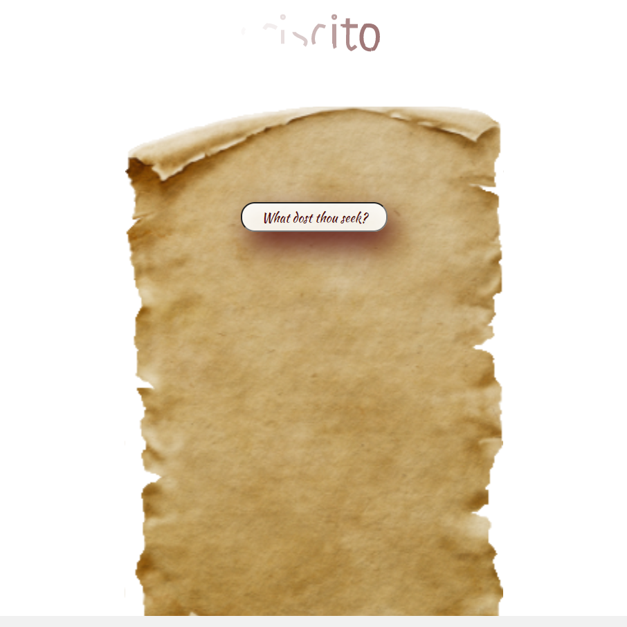

# _sciscito_

Latin, meaning _inquire_, _seek to know_, _investigate_, _search_, _question repeatedly_, or _question earnestly_

A staple student tool in the Hogwarts library. Witches and wizards use sciscito to search for spells, charms, enchantments, jinxes, hexes and curses.

Navigate the user interface with a magic wand and use the magic quill to search the Harry Potter API for your magical needs.

_Note: The Harry Potter API server is down indefinitely. Currently using dummy data. Will update ASAP._

### See it live!

[Demo](https://hp-spells.vercel.app/)

### Technology Used

- ReactJS
- SCSS
- Scalable Vector Graphics

